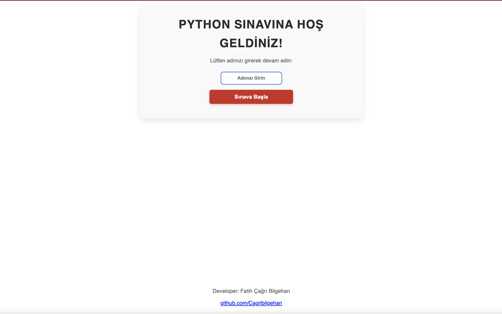
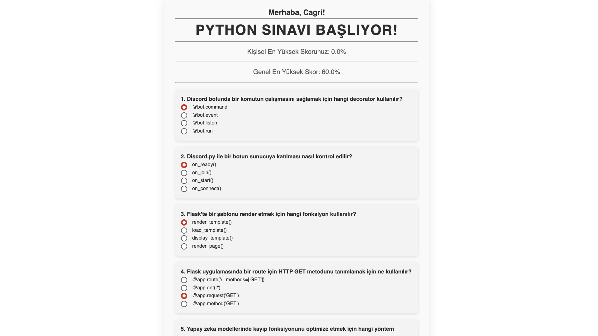
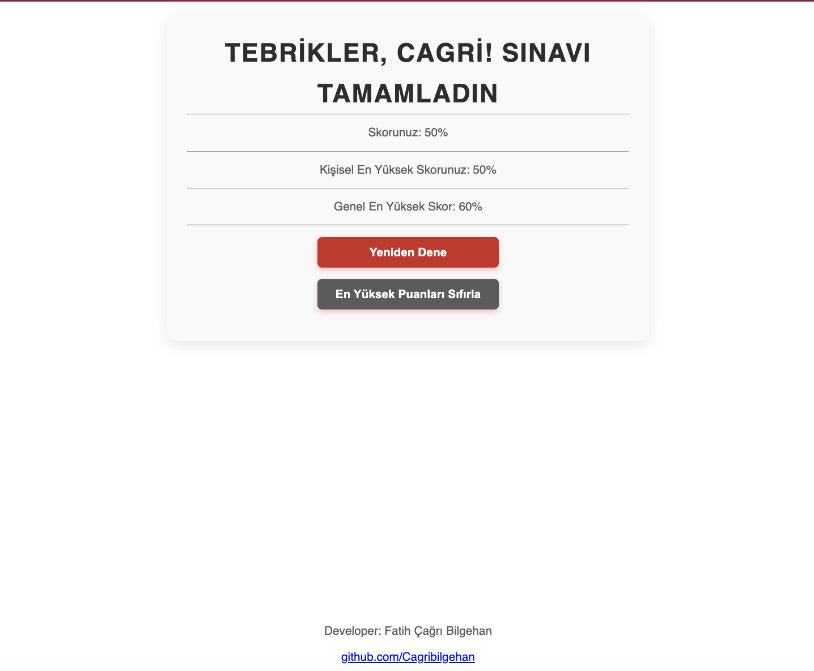

**Kodland Python Quiz**'e hoş geldiniz! Bu, Python becerilerinizi test etmek için Flask ile geliştirilmiş interaktif bir quiz uygulamasıdır. Discord bot geliştirme, web geliştirme, yapay zeka ve daha fazlası gibi konuları kapsayan 10 soru içerir. Kendinizi meydan okuyun ve bilginizi ölçün!

## Açıklama

Kodland Python Quiz, Python öğrenenler ve meraklılar için tasarlanmış bir Flask tabanlı web uygulamasıdır. Kullanıcı dostu arayüzü ile 10 çoktan seçmeli soru serisiyle eğlenceli ve eğitici bir deneyim sunar. İster yeni başlayan, ister gelişmiş bir geliştirici olun, bu quiz sizin için!

## Özellikler

- 10 interaktif quiz sorusu.
- Konular: Discord botları, Flask web geliştirme, yapay zeka ve NLP.
- Sorular ve sonuçları saklamak için SQLite veritabanı.
- HTML/CSS şablonlarıyla duyarlı tasarım.
- PythonAnywhere gibi platformlarda dağıtılabilir.

## Kurulum

Projeyi yerel olarak kurmak için aşağıdaki adımları izleyin:

### Ön Şartlar

- Python 3.10 veya üstü
- Flask
- Flask-SQLAlchemy
- Flask-Migrate
- Gunicorn (dağıtım için)

  ## Ekran Görüntüleri
- 
- 
- 
  
### İletişim
GitHub: @Cagribilgehan
E-posta: [cagribilgehan@gmail.com]
